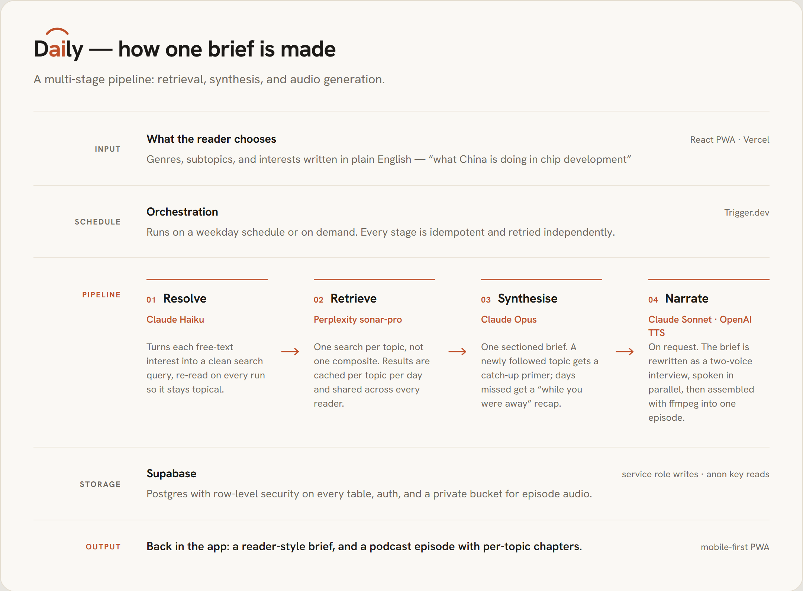

# Daily

A personalised news briefing that writes and narrates itself. You choose the topics once; every
weekday morning it researches them, writes one report, and — on request — reads it to you as an
eight-minute podcast.

**[Try the demo](https://newsagent-seven.vercel.app)** · no signup — the demo signs you straight in
· **[Landing page](https://newsagent-seven.vercel.app/landing/)**

The demo is seeded with real briefs generated by the live pipeline and then frozen. Generation is
switched off for that account, by a server-side flag rather than a hidden button, so the pipeline
can be inspected without anyone's API credits paying for it.

---

## How one brief is made



Four stages, orchestrated by Trigger.dev. Each is a separate task with its own retries and its own
idempotency check, so a failure in one never sinks the whole run — and a retry never duplicates
work or overwrites a finished report.

**1 · Resolve** — `claude-haiku-4-5`

A reader's topics come in three shapes: a genre, a subtopic within it, or a sentence in their own
words ("what China is doing in chip development"). The free-text ones are translated into a clean
search query by a cheap model, **re-read on every run** rather than translated once and stored, so
a standing interest stays pointed at whatever is currently happening in it.

**2 · Retrieve** — Perplexity `sonar-pro`

One search per topic, not one composite search. A composite query returns a blur; per-topic queries
return something worth summarising, and each carries its own citations.

Canonical topics — a subtopic like *Semiconductors* — are cached by `(topic, day)` in
`topic_news_cache` and shared across every reader. Free-text interests and first-time primers are
personal, so they are never cached. Fetches run strictly one at a time: the account's Perplexity
limit is on *simultaneous* requests, so spacing retries out does not help and concurrency does not
either.

**3 · Synthesise** — `claude-opus-4-8`

One pass produces the whole sectioned report, so the model can see the topics side by side and
avoid repeating the same story under two headings. Three things it handles that a naive
"summarise this" prompt does not:

- A topic the reader has never had before gets a **primer** — enough background to make today's
  development mean something — instead of a fragment of an ongoing story.
- Days the reader missed are folded into a **catch-up** at the top of their next brief.
- The reader's exclusions are applied here, in the prompt, rather than filtered afterwards.

A guard rejects a degraded response — a stubbed or short-changed section — rather than shipping it.
That guard is the reason synthesis is on Opus: Sonnet was tried as a cost saving and reverted
because it stubbed sections on primer-heavy first briefs.

**4 · Narrate** — `claude-sonnet-4-6` + OpenAI `gpt-4o-mini-tts`

Explicitly on request, never automatic, because it is by far the most expensive step. The brief is
rewritten as a two-voice interview — a rewrite, not a read-aloud, since prose written for the eye
is unbearable in the ear — then each speaker's turns are synthesised in parallel and assembled by
ffmpeg into one episode with a branded intro and per-topic chapters.

---

## The stack, and why

| | Why this one |
|---|---|
| **Perplexity `sonar-pro`** | Search and synthesis in one call, with citations. NewsAPI returns headlines and links, which means building scraping, ranking and deduplication before any of the interesting work starts. This skips that layer entirely. |
| **Anthropic Claude** | Three jobs at three price points: Haiku resolves queries, Opus writes the brief, Sonnet scripts the podcast. Model IDs are config constants in one file, so the cost/quality trade is a one-line change. |
| **Trigger.dev** | The pipeline is long-running, scheduled, and fails in the middle. Durable execution with per-task retries fits that better than a cron hitting a serverless function with a 60-second ceiling. |
| **Supabase** | Postgres, auth and a private audio bucket in one service, with row-level security on every table. The pipeline writes with the service role; the app reads as the signed-in user and can never read anyone else's rows. |
| **React on Vercel** | An installable PWA, designed phone-first because that is where a morning brief is actually read. |
| **OpenAI `gpt-4o-mini-tts`** | ElevenLabs was trialled first and dropped: better voices, but roughly $20–40 per user per month for daily audio, which no plausible price point supports. Its code path is still in the repo behind a flag. |

---

## Decisions worth explaining

**Four topics, hard-capped.** Every section is a paid search plus synthesis tokens, so the cap is
enforced in the shared planner (`shared/plan-topics.ts`) rather than in the UI — the pipeline
cannot exceed it even if a request asks it to.

**Genres are containers, not sections.** Originally a genre also became a broad report section,
which quietly inflated the topic count and produced vague writing. Now a genre only opens a drawer
of subtopics; the subtopics are the sections.

**Length and tone controls were removed.** Readers could pick a report length and a voice. Neither
earned anything a reader noticed, and both widened the surface the product had to explain, so
synthesis is now fixed at one length and one tone. The columns are left in the table unused rather
than dropped.

**The demo never persists.** A visitor can reorder, add and delete topics and watch the preview
respond — customisation is the product, so blocking it would hide the point — but nothing is
written back. The nightly reset job exists anyway, as a second line of defence.

---

## Not built yet

- Reader-chosen sources per topic. Interesting design work, deliberately deferred.
- Subscription billing. The unit economics are modelled; the checkout is not.
- Push notifications when a brief lands.
- A native iOS wrapper. The PWA installs to the home screen today.
- The weekday cron is currently switched off. Generation is on-demand only, to keep a public demo
  from costing money in the background.

---

## Layout

```
apps/web/          React PWA → Vercel
  src/             screens, components, hooks
  api/             serverless functions (generate, podcast, subtopic suggestions)
  public/landing/  the landing page, served outside the SPA
trigger/src/
  jobs/            one file per pipeline stage, plus the cron and the demo seeders
  lib/             Perplexity, Anthropic, TTS, audio assembly, concurrency
supabase/migrations/   schema, RLS, storage — the source of truth for the data model
shared/            types and the topic planner, imported by both the app and the pipeline
e2e/               Playwright suite, run against the deployed app
docs/              architecture diagram
```

`shared/` is the interesting part of the layout: the topic planner lives there, so the app's preview
of "what your next brief will contain" and the pipeline's actual section list are the same function,
and cannot drift.

## Running it

Each workspace installs and runs on its own — there is no root package.

```bash
npm --prefix apps/web install && npm --prefix apps/web run dev   # the app
npm --prefix trigger install && npm --prefix trigger run dev     # the pipeline, against Trigger.dev
npm --prefix e2e install && npm --prefix e2e test                # end-to-end, needs DEMO_BASE_URL
```

Secrets are environment variables only. `SUPABASE_URL`, `SUPABASE_ANON_KEY`,
`SUPABASE_SERVICE_ROLE_KEY`, `ANTHROPIC_API_KEY`, `PERPLEXITY_API_KEY`, `OPENAI_API_KEY` —
and `ELEVENLABS_API_KEY` to wake the dormant voice path. The service role key is server-side only
and never reaches the browser; the app uses the anon key and relies on row-level security.

## Licence

[MIT](LICENSE).
